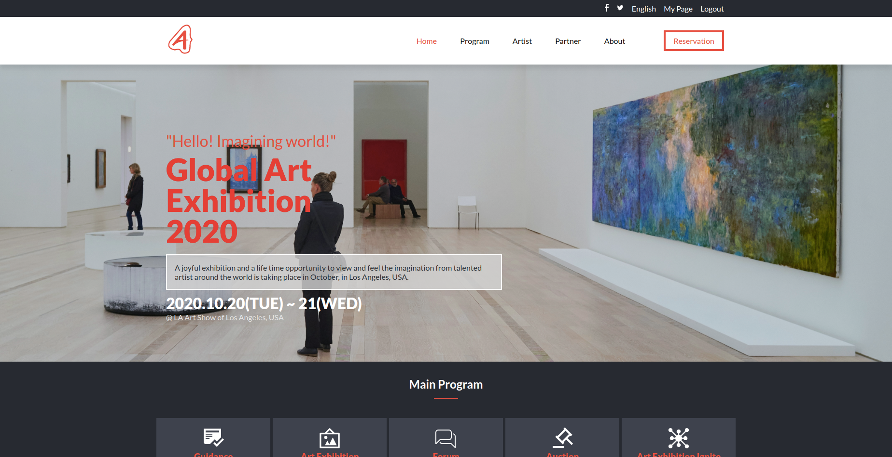

# Global Art Exhibition 2020.

## Definition

This website provides the information about the upcoming art exhibition. And also provide an option to reserve a seat for exhibition.

## About the Project

This project is based on an online website for an art exhibition and a part of my capstone project for HTML & CSS main curriculum.

The features of this project are listed below:
1. The website is completely responsive to mobile and screen sizes above 768px.

2. The site contains information for art exhibition:
- Common information on every page.
    - Header with site navigation links.
    - Footer with logo and copyright information.

- Information on the Homepage.
    - Banner image with information regarding when the event is going to happen.
    - Main program of the event.
    - Featured artists.
    - Partners who supported the program.

- Information on the about us page:
    - Some information about the event
    - Information regarding how the logo was chosen.
    - Past exhibition links.

- Information on the ticket page:
    - Options to select tickets for 1 day 2 days or affiliate/partner and price regarding the ticket type.
    - Options to choose different launch based on the day of the visit.

## Built With

- HTML
- CSS
- Sass
- Javascript

## Live Demo

[Live Demo Link](https://art-exhibition.netlify.app/)

## Getting Started

**Just clone this repo and open index.html file in your browser then you are good to go.**

**To get a local copy up and running follow these simple example steps.**

**clone the repo.**

## Authors

👤 **Dipesh Bajgain**

- GitHub: [@dipbazz](https://github.com/dipbazz)
- Twitter: [@dipbazz](https://twitter.com/dipbazz)
- LinkedIn: [Dipesh Bajgain](https://www.linkedin.com/in/dipbazz/)

## 🤝 Contributing

Contributions, issues, and feature requests are welcome!

## Show your support

Give a ⭐️ if you like this project!

## Acknowledgments

- Thanks to [Cindy Shin](https://www.behance.net/adagio07) for this [marvellous & amazing UI](https://www.behance.net/gallery/29845175/CC-Global-Summit-2015)
- icons used from [iconify](https://iconify.design/)
- Font **lato** used from [google fonts](https://fonts.google.com/)
- Source of featured artists image and a short bio is [wikiart](https://www.wikiart.org/en/)
- Images source in the website is [unsplash](https://unsplash.com/) from authors [Xavier von Erlach](https://unsplash.com/@xavier_von_erlach), [Highlight ID](https://unsplash.com/@highlightid), [Pauline Loroy](https://unsplash.com/@paulinel), [Paweł Czerwiński](https://unsplash.com/@pawel_czerwinski)
- Partner section logo source is [pngegg](https://www.pngegg.com/)

## 📝 License

This project is [MIT](./LICENSE) licensed.
